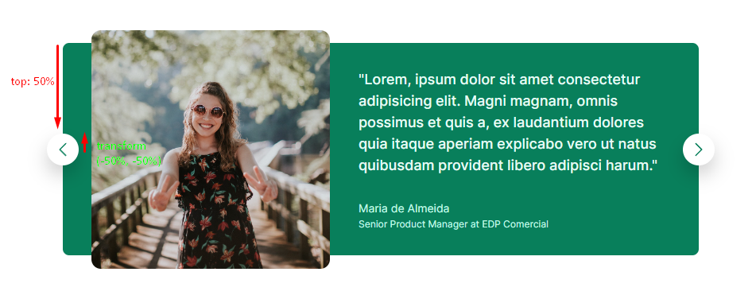

# How to use transform to perfectly align items

After you position your elements with `top: 50%`, you still need to move them half height up. This is done with `translate`.

Translate is used to move an element on `%` of the elements width and height.

```css
.btn--left {
  left: 0;
  top: 50%;
  transform: translate(-50%, -50%);
}

.btn--right {
  right: 0;
  top: 50%;
  transform: translate(50%, -50%);
}
```


