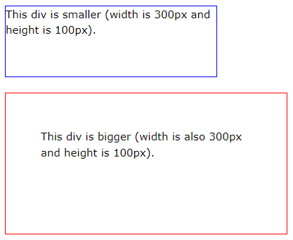
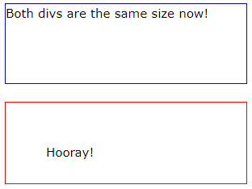

# What is box-sizing property used for?

The CSS box-sizing property allows us to include the padding and border in an element's total width and height.

By default, the width and height of an element is calculated like this:

```
width + padding + border = actual width of an element
height + padding + border = actual height of an element
```



With the CSS box-sizing property, padding and border are included in the width and height:



Since the result of using the box-sizing: border-box; is so much better, many developers want all elements on their pages to work this way.

```css
* {
  margin: 0;
  padding: 0;
  box-sizing: border-box;
}
```
