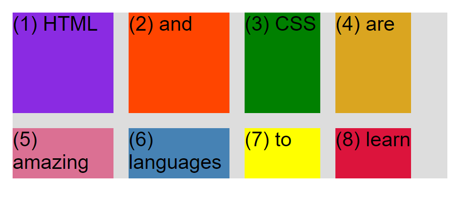
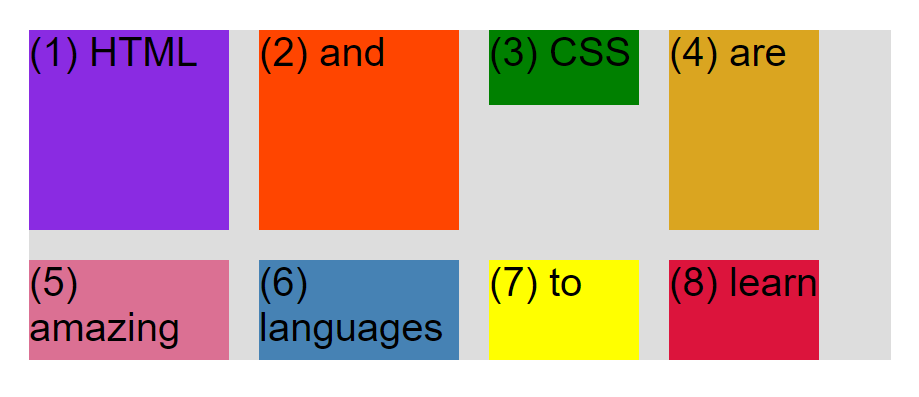
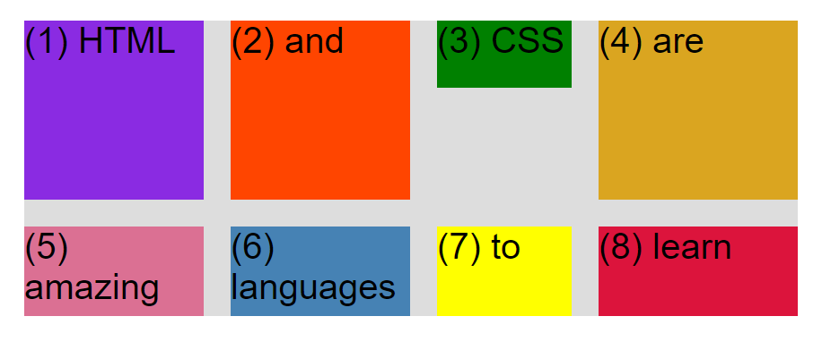
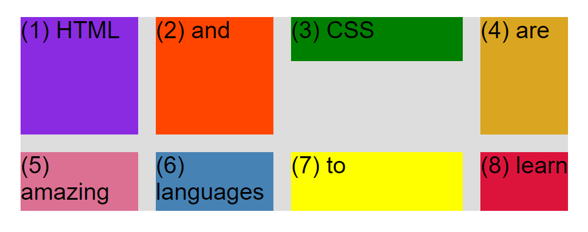
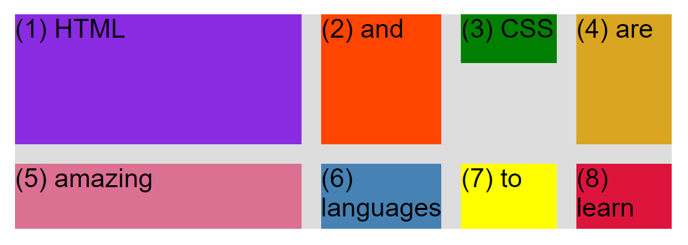

# Grid examples

## Fixed size columns

```css
.container--1 {
  /* CSS GRID */
  display: grid;
  grid-template-columns: 200px 200px 150px 150px;
  grid-template-rows: 200px 100px;
  gap: 30px;
}
```



## Element height has a priority over grid-template-rows

```
.el--3 {
  background-color: green;
  height: 75px;
}
```



## 1fr

The last column fills all the remaining space

```css
.container--1 {
  /* CSS GRID */
  display: grid;
  grid-template-columns: 200px 200px 150px 1fr;
  grid-template-rows: 200px 100px;
  gap: 30px;
}
```



## 1fr auto

The 3rd column fills all the remaining space, the 4th column fills the space based on it's content

```css
.container--1 {
  /* CSS GRID */
  display: grid;
  grid-template-columns: 200px 200px 1fr auto;
  grid-template-rows: 200px 100px;
  gap: 30px;
}
```



## 3fr 1fr 1fr 1fr

The 1st column takes 50% of space, the rest of the columns take 50% of space (or 1/6 space each)

```css
.container--1 {
  /* CSS GRID */
  display: grid;
  grid-template-columns: 3fr 1fr 1fr 1fr;
  grid-template-rows: 200px 100px;
  gap: 30px;
}
```



## 3fr repeat(3, 1fr) = 3fr 1fr 1fr 1fr

You can use `repeat(times, width)` if you don't want to specify every column explicitly.

```
.container--1 {
  /* CSS GRID */
  display: grid;
  grid-template-columns: 3fr repeat(3, 1fr);
  grid-template-rows: 200px 100px;
  gap: 30px;
}
```


