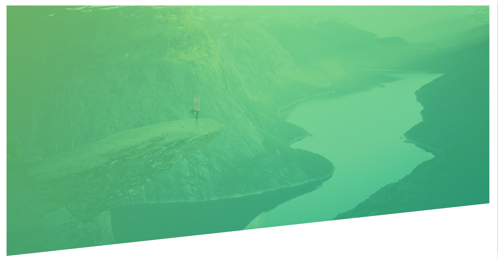

# How to setup an image with gradient and clipart

How to setup this image with CSS and HTML?



Solution:

```css
.header {
  height: 95vh;

  /* Set a linier-gradient with the image */
  background-image: linear-gradient(
      to right bottom,
      hsla(111, 55%, 64%, 0.798),
      hsla(160, 64%, 43%, 0.798)
    ),
    url("../img/hero-small.jpg");
  background-size: cover;
  background-position: top;
  position: relative;

  /* Cut an image */
  clip-path: polygon(0 0, 100% 0, 100% 75vh, 0 100%);
}
```

References:
* https://www.udemy.com/course/advanced-css-and-sass/