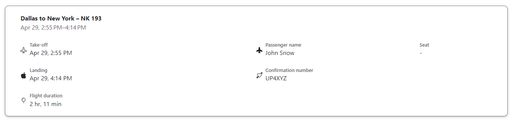

# Create a ticket confirmation form with HTML and CSS



Demo: https://web-platform-ja5sch.stackblitz.io

```css
* {
  box-sizing: border-box;
}

body {
  padding: 1rem;
  font-family: "Google Sans", Roboto, RobotoDraft, Helvetica, Arial, sans-serif;
  font-weight: 400;
  color: #202124;
}

.ticket-container {
  padding: 20px 40px;
  border: 1px solid gray;
  border-radius: 10px;
  box-shadow: 0 1px 2px 0 rgb(60 64 67 / 30%), 0 2px 6px 2px rgb(60 64 67 / 15%);
}

.header {
  margin-bottom: 1.5rem;
}

.grid {
  display: grid;
  grid-template-columns: 3fr 2fr 1fr;
  gap: 1.5rem;
}

.flex {
  display: flex;
  gap: 0.5rem;
  justify-items: center;
  align-items: center;
}

.grid-col-2 {
  grid-column: 2 / 4;
}

.datetime,
.label {
  color: #5f6368;
}

.label {
  font-weight: 500;
  font-size: 80%;
}

@media (max-width: 580px) {
  .grid {
    grid-template-columns: 1fr 1fr;
  }

  .grid-col-2 {
    grid-column: 1 / 2;
  }
}

@media (max-width: 440px) {
  .grid {
    grid-template-columns: 1fr;
  }
}
```
