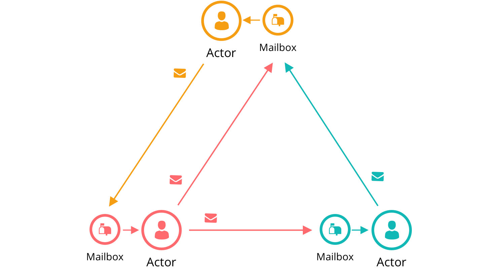

# Actors and Processes

One of the ways to implement concurrency without the pain of synchronizing access to shared memory is to use actors.

* An actor is an independent processor with its own local (and private) state. Each actor listens to his 'mailbox' and process appearing messages. If the mailbox is empty, it goes to sleep.

A few notes about this approach:

* Nothing schedules what happens next, or orchestrates the workflow
* The only state in the system is held in messages and in the local (and private) state of each actor
* All messages are one way (no replying). If you want an actor to return a response, you include your own mailbox address in the message, and it will (eventually) send the response as just another message to that mailbox
* An actor processes each message to completion, and only one message at a time

As a result, actors execute concurrently, asynchronously, and share nothing.

> Use actors for concurrency without shared state

Three actors to implement a diner scenario: the customer, the waiter, and the pie case.

The overall message flow:
1. We tell the customer that they are hungry
2. In response, they'll ask the waiter for pie:
   - `dispatch(state.waiter, { type: 'order' }, customer: self)`
3. The waiter will ask the pie case to get some pie to the customer:
   - `dispatch(state.pieCase, { type: 'get slice' }, customer: msg.customer, waiter: self)`
4. If the pie case has a slice available, it will send it to the customer and notify the waiter to add it to the bill:
   - `dispatch(msg.customer, { type: 'put on the table' })`
   - `dispatch(msg.waiter, { type: 'add to order' }, customer: msg.customer)`

In the actor model, there's no need to write any code to handle concurrency. There's also no need to orchestrate like 'do this, do that'. The actors work it out for themselves based on the messages they receive.

References:
* The Pragmatic Programmer: Your Journey To Mastery, 20th Anniversary Edition (2nd Edition)