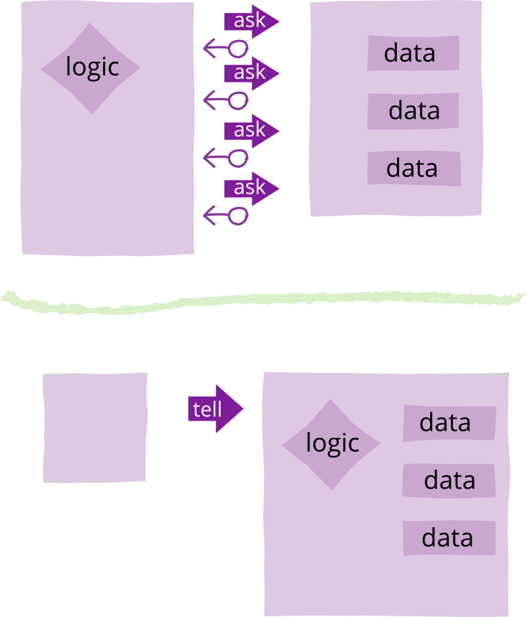

# Tell, Don't Ask

Tell-Don't-Ask is a principle that helps people remember that object-orientation is about bundling data with the functions that operate on that data. It reminds us that rather than asking an object for data and acting on that data, we should instead tell an object what to do ([source](https://martinfowler.com/bliki/TellDontAsk.html)).

```
public void applyDiscount(customer, order_id, discount) {
  totals = customer
    .orders
    .find(order_id)
    .getTotals();

  totals.grandTotal = totals.grandTotal - discount;
  totals.discount = discount;
}
```

Delegate the discounting to the total object:

```
public void applyDiscount(customer, order_id, discount) {
  customer
    .orders
    .find(order_id)
    .getTotals()
    .applyDiscount(discount);
}
```

We should get the order we want directly from the customer:

```
public void applyDiscount(customer, order_id, discount) {
  customer
    .findOrder(order_id)
    .getTotals()
    .applyDiscount(discount);
}
```

There's no need to expose an object for storing totals:

```
public void applyDiscount(customer, order_id, discount) {
  customer
    .findOrder(order_id)
    .applyDiscount(discount);
}
```

We can end-up with `customer.applyDiscountToOrder(order_id)` but the best is the enemy of the good.


